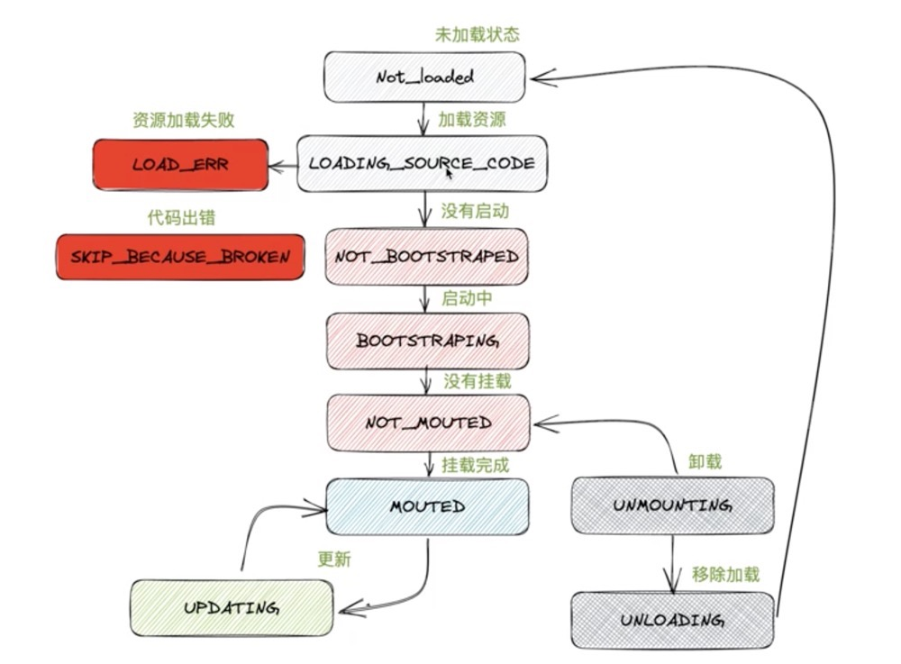

### single-spa


single-spa 需要根据接入协议改写应用, bootstrap (启动)， mount、unmount

### 应用首次加载

```js
// 访问/a
app1 bootstrap

app1 mount

// 切换 /b
app1 unmout
app2 bootstrap
app2 mount

// 访问/a
app2 unmount
app1 mount
```

### 应用的生命周期

当应用路径没匹配的时候，状态为未加载。

路径匹配好的话为已加载

应用启动之后，状态为挂载

路径切换的时候，状态为卸载


当**路径匹配**到的时候开始加载对应的资源（systemJS Loading source code，状态），执行完用户用户load函数，状态切换为NOT_BOOTSTRAPED

此后执行start 将进入新的路由监听函数，此函数对匹配到的app启动挂载，没匹配到的卸载





### 路由监听

因为第三方代码也可能监听hashchange，这样就会造成一个问题，就是触发hashchange的时候，我的应用还没有mount
```js
 window.addEventListener('hashchange', function () {
    console.log(window.location.hash, 'p----')
})

 let app2 = {
    bootstrap: async () => console.log('app2 bootstrap1'),
    mount: [
    async () => {
        // new Vue().$mount()...
        return new Promise((resolve,reejct)=>{
            setTimeout(()=>{
                console.log('app2 mount')
                resolve()
            },1000)
        })
    }
    ],
    unmount: async () => {
        console.log('app2 unmount')
    }
}


// 需要劫持原生的路由系统，保证当我们的应用加载完成后再切换路由
export function callCaptureEventListeners(e){
    if(e){
        const eventType = e[0].type;
        if(listentingTo.includes(eventType)){
            capturedEventListeners[eventType].forEach(listener => {
                listener.apply(this,e)
            });
        }
    }
}

```
